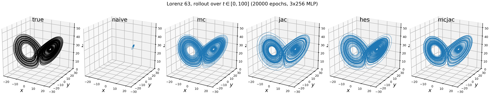
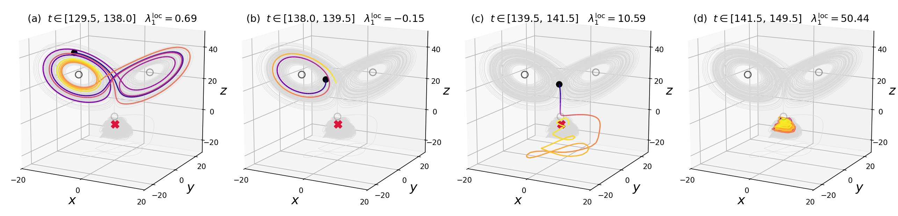

# MCJac: model-constrained randomized Jacobian matching for chaotic dynamics

MCJac compares the Jacobians of the true and the learned vector field at randomly
perturbed states. A Taylor expansion of that loss contains a Hessian-mismatch
term, so it supplies second-order supervision using only Jacobian evaluations,
without ever forming the full Hessian tensor. This folder is a self-contained
reference implementation: the five supervision strategies of the paper side by
side, the stored five-seed evaluation the manuscript's table is made from, and
the scripts that draw the figures below.

Companion code for

> S. Kang, H. V. Nguyen and T. Bui-Thanh, *Second-order consistency for learning
> chaotic dynamics via randomized Jacobian matching,* Chaos (under review), 2026.

## Example

`train_l63.py` trains all five objectives on Lorenz 63 and rolls each model out
from one held-out on-attractor state. 



`escape_fig.py` visualizes one stored failed rollout of `mc` at seed 36 in four
windows across the transition. The trajectory first circulates on both lobes,
then leaves the physical attractor and becomes trapped in a small spurious
region below it. This example illustrates why failure frequency is reported
separately from accuracy on the physical attractor.



## What separates the methods: five seeds, not one rollout

`seed_table.py` summarizes the Lorenz 63 results across five training seeds and 1,000 on-attractor initial conditions per seed.

```
$ python3 seed_table.py                                        

Training-seed variability of the Lorenz 63 methods (m = 1), five seeds, 1,000 on-attractor ICs

        n_outlier per seed 32/33/34/35/36 |                    W1               W1_lam1               W1_lam2               W1_lam3
-----------------------------------------------------------------------------------------------------------------------------------
mc                           0/0/18/38/13 |     0.8499 +/- 0.0931 1.351E-02 +/- 7.6E-03 9.482E-03 +/- 8.8E-04 8.538E-02 +/- 3.8E-02
mcjac                           0/0/0/0/0 |     0.8264 +/- 0.0380 3.188E-03 +/- 1.9E-03 1.135E-03 +/- 7.9E-05 1.256E-02 +/- 1.0E-02
naive            1000/1000/1000/1000/1000 | 578.5175 +/- 546.8165 7.273E-01 +/- 1.9E-01 5.119E-01 +/- 3.0E-01 1.199E+01 +/- 5.2E-01
jac                           1/27/7/3/11 |     0.9079 +/- 0.1229 6.679E-03 +/- 3.1E-03 1.082E-03 +/- 4.0E-04 1.761E-02 +/- 1.4E-02
hes                             0/4/4/3/6 |     0.8713 +/- 0.1030 4.956E-03 +/- 2.9E-03 6.619E-04 +/- 1.7E-04 2.190E-02 +/- 1.5E-02
```

`n_outlier` is the number of rollouts, per 1,000 initial conditions, that are
failure-flagged or have a catastrophic leading-Lyapunov error,
|lambda1_hat - lambda1_ref| > 0.1. It therefore reports the frequency of
leaving or failing to reproduce the physical chaotic regime.

`W1` is the Wasserstein-1 distance between the invariant measures of the model
and reference system, and `W1_lam_j` is the Wasserstein-1 distance between their
finite-time Lyapunov-exponent distributions.


Across the five training seeds, `mcjac` has 0 flagged rollouts out of 5,000,
compared with 17 for `hes`, while their on-attractor accuracy is otherwise
similar. The seed experiment therefore highlights a difference in robustness
that is not apparent from accuracy statistics alone.


 
The stored `data/onattr_*.npz` files contain per trajectory: `wd`, `lyap`, the failure flags,
the 1,000 initial conditions and the training configurations. Because chaotic float32 simulations can vary across XLA processes, these results may not be reproduced bit-for-bit.
 

## Quick start

```
$ python3 -m venv .venv && . .venv/bin/activate
$ pip install "jax[cuda12]" optax matplotlib                                                   
$ python3 paper_fig1.py                         
$ python3 train_l63.py --method mcjac           
```

`seed_table.py` and `escape_fig.py` read stored results and need only `numpy`
and `matplotlib`. Every script writes into `figure/`; `train_l63.py` overwrites
`figure/demo_l63.png` unless given `--out`.

NVIDIA RTX 4500 Ada was used under `Python` 3.12.3,
`jax` 0.9.1.dev20260215 (CUDA 12), `optax` 0.2.6, `numpy` 2.1.3 and
`matplotlib` 3.10.8.

## Files

- `losses.py` -- the five supervision objectives
- `train_l63.py`, `l63.py` -- Lorenz 63 training and rollout demo
- `paper_fig1.py`, `data/naive_m1.npz` -- Figure 1 from the released model
- `seed_table.py`, `data/onattr_*.npz` -- stored five-seed evaluation
- `escape_fig.py`, `data/escape/` -- one rollout leaving the attractor
- `LICENSE` --  MIT License, matching the parent repository


## License and citation

This code is released under the MIT License (LICENSE).

Copyright © 2026 Shinhoo Kang.

The method and accompanying paper are joint work with H. V. Nguyen and T. Bui-Thanh. If you use this work, please cite the paper for the method and the Zenodo archive for the reference implementation. Both records credit all three authors.
